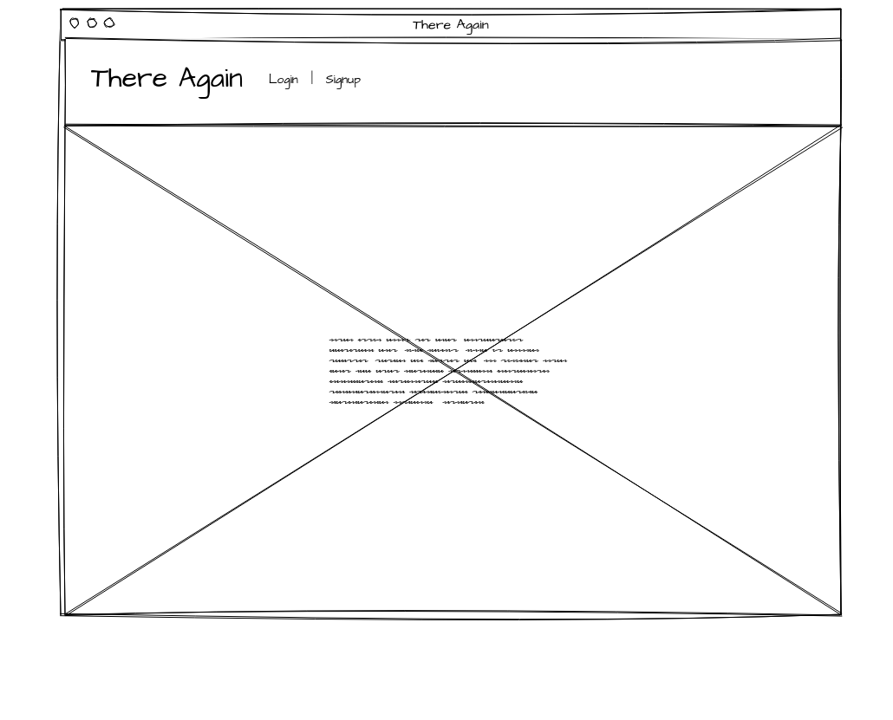
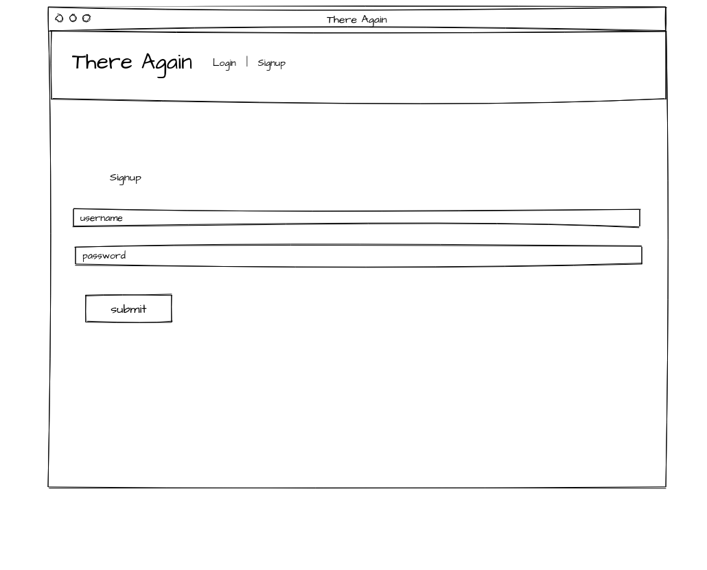
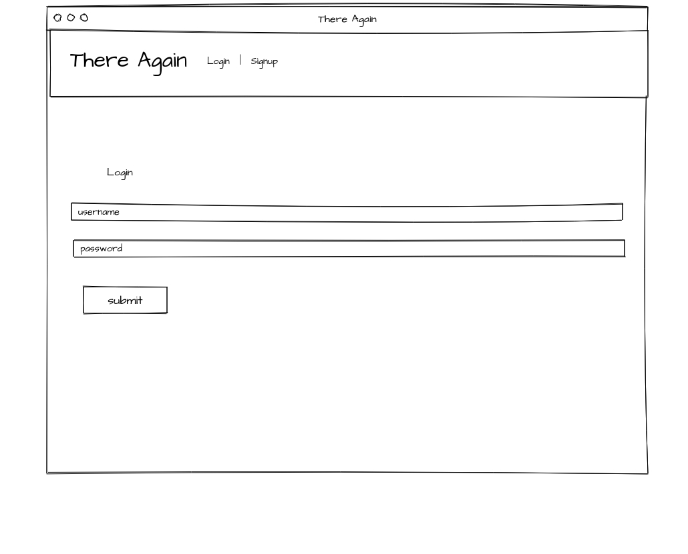
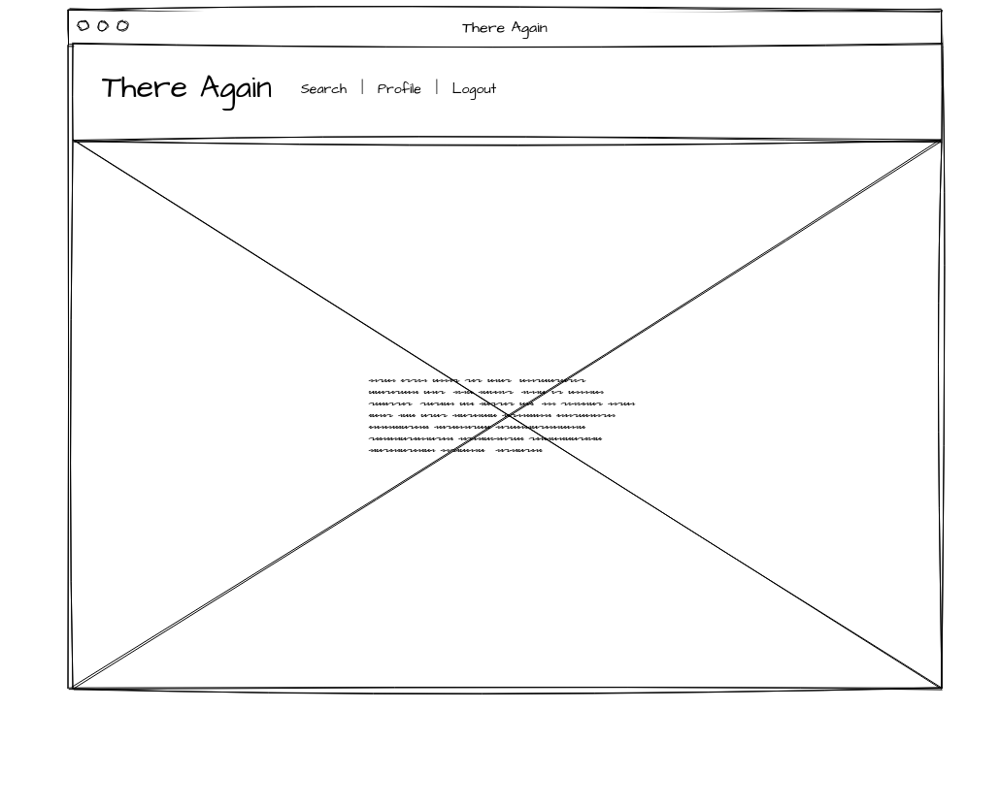
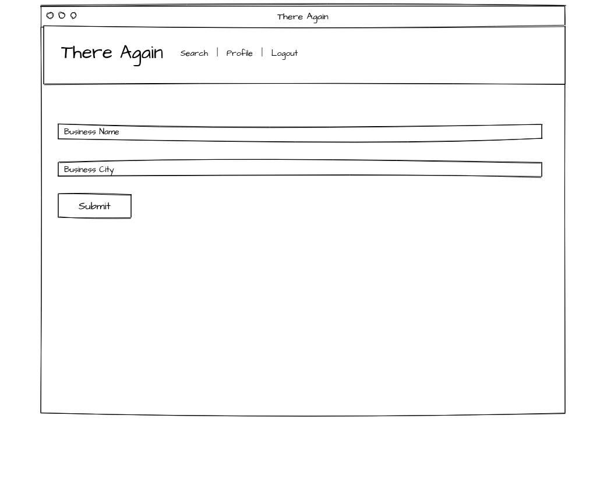
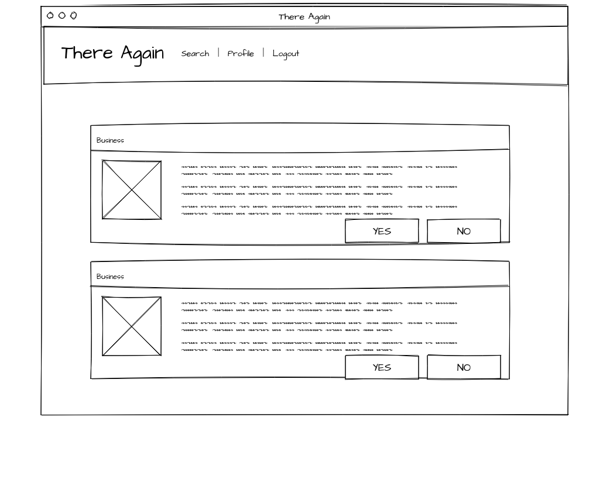
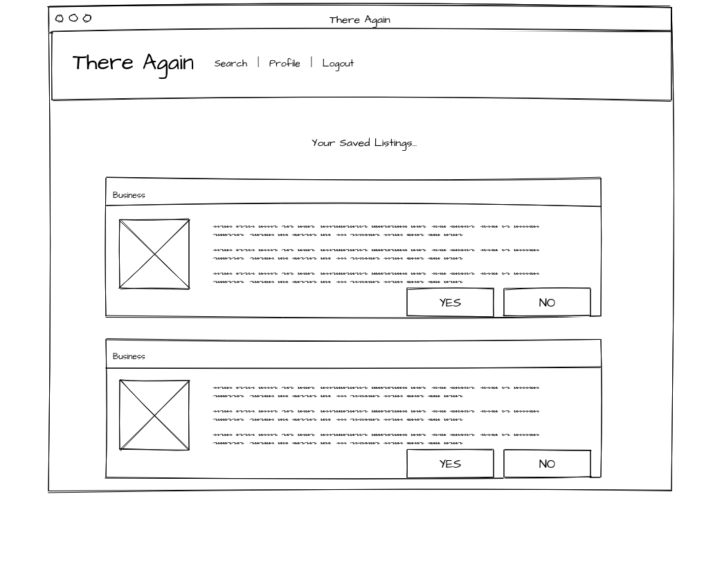

# Project 2: There Again

There Again will enable users to search for businesses by name and city and add them to their user-specific list of businesses they would or would not like to come back to in the future. In other words, There Again or NOT There Again. 

There Again will be a full-stack application utilizing the Yelp API, Mongo, Mongoose, Express, EJS, Node, Passport, Mocha and Chai for testing, and more of the frameworks, libraries, and languages we've learned over the past 6 weeks of WDI 4. 

# Trello Link:
[There Again on Trello](https://trello.com/b/Bsp3iBtR/project-2-there-again)

# Heroku Link:
[There Again on Heroku](https://aqueous-forest-60300.herokuapp.com)

# Wireframes

## landing page

## signup page

## login page

## home page post-signup

## search page

## search results page

## profile page

# Project Log

## Thursday, August 3rd

I sit here struggling to decide how and where to start on this.. Then, Kanye's lyrical genius fills the air of the WeWork hallway, as if the universe is mocking my suffering through Tunely. *shutters*
I need to get at least 25 points completed by EOD Friday. That means succesfully making an API call to Yelp and receiving a response - made slightly more complicated by their OAUTH / token requirements on top of the usual ID and Key, completing signup functionality (passport, username and password encypting and storage), completing login/logout functionality (passport, authenticating user and allowing access to user only app features), completing search functionality (means API call and response can be executed and displayed on the site rather than just the terminal), plus one more Trello card.... 
Oh No... What Have I done.. maybe Lyft will take me back... I could just keep driving for the rest of my life... right? 

## Friday, August 4th

Yesterday I succesfully made an API call to and received a useable response from Yelp. I was worried the additional OAUTH and Token requirments would make this a miserable if not impossible experience for me. I dont want to jinx this but it seems like it was easy, at least from the terminal. Today I hope to incorporate the call and response into my app so the call and response occur when the user searches for a business by name using the search bar.
I'll also need to get the signup, login/logout, and user profile features and functions working today. That also means data handling and storage... phew.

## Saturday, August 5th

Working at home should be interesting... coding while the Cowboys vs Cardinals pre-season game is on in the living room. So far it's actually been fairly productive. I've modified the api calling code to return the top 5 matches rather than just one match from Yelp. I've also got my User profile info being collected and stored as part of the signup process! Still need to get api call executing on "search" using input parameters and api response rendering on the page. Also still need to make those results saveable to User list and displayed on User profile... ugh, this is gonna be ugly but it just might be done by project presentations on Tuesday.

## Monday, August 7th

So, Sunday was a wash... Literally accomplished nothing. This morning around 7:30ish, I finally got my API call to trigger when the search submit button is clicked, passing in the user input as variables in the api call function and successfully returning a response from Yelp. Now struggling to render the response to the page rather than console logging in the terminal. It'll be a miracle if I have a working app to present on Tuesday.

